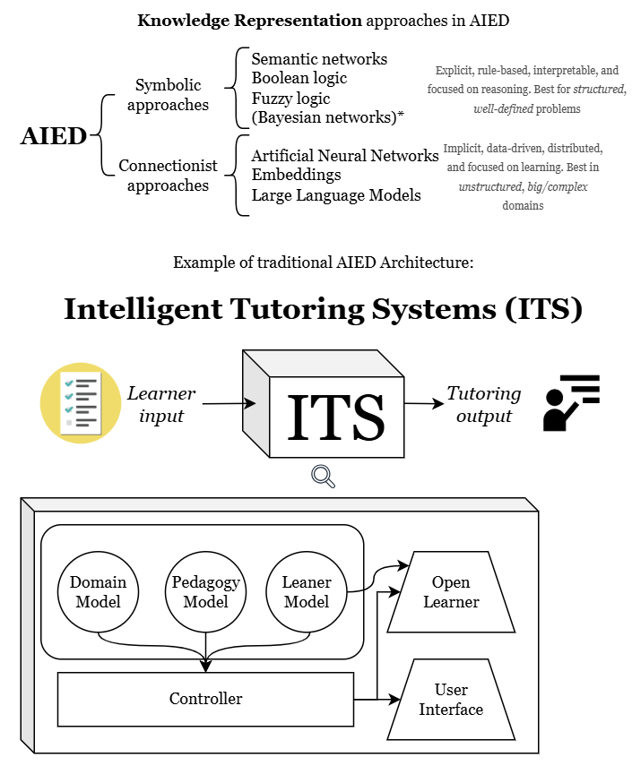

# ITS-ENEM

**Bem-vindo(a)!** Este repositório é um trabalho em andamento utilizado para propósitos ilustrativos de como um Sistemas de Tutoria Inteligente (ITS) pode ser implementado na prática. 

Mas por que ITS são relevantes?

> O "Problema 2 Sigma", identificado por Benjamin Bloom (1984), demonstra que o tutoria individualizada pode elevar o desempenho estudantil em *até* dois desvios padrão sobre o ensino tradicional. Contudo, a tutoria individual é de difícil escalabilidade por restrições logísticas e econômicas. Sistemas Tutores Inteligentes (ITS) emergem como alternativa, usando IA para oferecer instrução personalizada e adaptativa, visando replicar a eficácia do tutor humano e democratizar o acesso à educação de qualidade em larga escala.

*Figura: Representação de conhecimento em AIED: abordagens simbólicas e conexionistas, e arquitetura de Sistemas de Tutoria Inteligente (ITS).*

Este repositório tem objetivo de servir como template base para implementação do seu ITS. 

## 🛠️ Como criar meu próprio ITS?

### Etapa # 1 - Projete seus modelos.

- **Modelo de domínio**: define a estrutura de tópicos e áreas do seu conteúdo.
- **Modelo pedagógico**: define as regras de feedback do ITS.
- **Modelo de aluno**: define em variáveis sobre o processo de aprendizagem do aluno diante das questões do ENEM.

> Dica: Explore a pasta `model` e os arquivos `domain.yml`, `pedagogy.yml` e `learner.yml`. Para implementar seu próprio ITS, um caminho recomendado seria:
> 1. Implementar o seu próprio modelo de domínio (model/domain.yml) para representar o conhecimento da tarefa
> 2. Implementar o seu próprio modelo pedagógico (model/pedagogy.yml) para indicar tipos de feedback (saídas esperadas, "o que falar") e regras ("quando falar")
> 3. Implementar o seu próprio modelo de aluno (model/learner.py) com base nas variáveis utilizadas nas regras do modelo pedagógico

### Etapa 2 - Implemente o controlador

Após a fase de design, você deve então implementar a lógica do controlador, que irá carregar e manipular dados para gerar o feedback baseado nos modelos projetados. 

(Em construção)...

### Etapa 3 - Implemente UI e OLM

(Em construção)...

## 📚 Exemplo de inspiração: Mais sobre o ITS-ENEM

O ITS-ENEM foi o caso de uso utilizado para construção desse template de ITS. A seguir, mais informações sobre o escopo do projeto:

> Pitch: "Não conseguiu sua aprovação no SISU? Vai precisar fazer outro ENEM? ITS-ENEM fornece tutoria de estudos em tópicos e áreas das **Ciências da Natureza do ENEM** com dicas de estudo para fortalecer sua auto-determinação e confiança para o próximo exame! 🚀"

## ❓ Do Que Se Trata?
- **📝 Dicas Inteligentes**: Baseado no seu gabarito do ano anterior, diz o que você precisa estudar (ex: "Revise Mitose!").
- **😊 Feedback Legal**: Te incentiva com mensagens como "Você é craque em DNA!" nos tópicos que você foi bem.

## 💡 Como Isso Funciona?
- **Entradas**: Escolha A, B, C, D ou E.
- **Saidas**: Receba um relatório pedagogicamente significativo com tópicos e áreas para focar nos seus estudos para futuros exames.

## 💬 Fórum de Discussões
Entre em contato pelo [GitHub](https://github.com/adaj/its-enem/issues)! 😊
